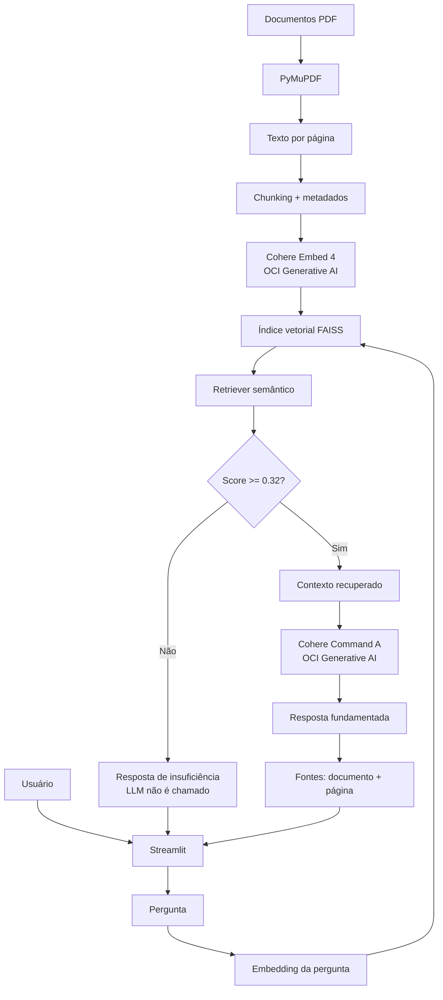

# 🏠 ImobIA — Agente Inteligente de Orientação Imobiliária

O **ImobIA** é um agente inteligente desenvolvido para o **Challenge Alura Agente**.  
Ele utiliza **RAG (Retrieval-Augmented Generation)** para responder perguntas em linguagem natural com base em uma coleção de documentos PDF sobre compra de imóveis, documentação, financiamento e conceitos imobiliários.

O objetivo do projeto é demonstrar uma aplicação de IA generativa com **recuperação semântica, grounding documental, controle de alucinação, interface conversacional e integração real com Oracle Cloud Infrastructure (OCI)**.

---

## 📌 Visão geral

Em vez de responder apenas com o conhecimento geral de um modelo de linguagem, o ImobIA segue este fluxo:

1. recebe a pergunta do usuário;
2. transforma a pergunta em embedding;
3. busca os trechos mais relevantes da base documental;
4. aplica um limiar mínimo de relevância;
5. envia apenas o contexto recuperado ao modelo generativo;
6. gera uma resposta fundamentada;
7. informa os documentos e páginas utilizados como fonte.

Quando não existe contexto suficientemente relevante, o LLM **não é chamado** e o agente retorna:

> Não encontrei informação suficiente na minha base de conhecimento para responder a essa pergunta.

Esse comportamento reduz respostas inventadas e torna o funcionamento do agente mais transparente.

---

## ✨ Principais funcionalidades

- 📄 leitura automática de documentos PDF;
- ✂️ divisão do conteúdo em chunks com metadados;
- 🧠 embeddings via **OCI Generative AI — Cohere Embed 4**;
- 🔎 busca vetorial com **FAISS**;
- 🤖 geração de respostas com **Cohere Command A**;
- 🛡️ limiar de relevância para evitar respostas fora da base;
- 📚 exibição de documento e página utilizados na resposta;
- 💬 interface conversacional em **Streamlit**;
- 🕘 histórico da conversa durante a sessão;
- 💡 perguntas sugeridas para demonstração;
- 🧪 suíte automatizada de testes;
- 📊 avaliação formal do RAG com 22 casos;
- 🔐 auditoria para impedir publicação de credenciais no GitHub;
- 🐳 preparação para execução com Docker.

---

## 🏗️ Arquitetura



### Fluxo resumido

```text
Pergunta
   ↓
Embedding OCI
   ↓
FAISS
   ↓
Retriever
   ↓
Filtro de relevância (0.32)
   ↓
Contexto documental
   ↓
Cohere Command A
   ↓
Resposta + fontes
```

Mais detalhes: [`docs/arquitetura.md`](docs/arquitetura.md).

---

## 📚 Base de conhecimento

O projeto utiliza cinco PDFs fictícios e educacionais:

| Documento | Conteúdo principal |
|---|---|
| `01_guia_compra_imovel.pdf` | etapas e cuidados gerais na compra de um imóvel |
| `02_documentacao_imovel.pdf` | documentos e verificações relacionadas à operação |
| `03_financiamento_imobiliario.pdf` | simulação, análise de crédito, aprovação, entrada e FGTS |
| `04_faq_imobiliario.pdf` | perguntas frequentes sobre o processo de compra |
| `05_glossario_imobiliario.pdf` | definições de termos como matrícula, ITBI e análise de crédito |

Os arquivos estão em:

```text
data/documents/
```

> **Importante:** a base foi criada exclusivamente para fins educacionais e de demonstração. O ImobIA não substitui orientação jurídica, financeira, bancária ou imobiliária profissional.

---

## 🧰 Tecnologias utilizadas

| Tecnologia | Uso no projeto |
|---|---|
| Python 3.12 | linguagem principal |
| Streamlit | interface web conversacional |
| PyMuPDF | leitura dos PDFs |
| NumPy | manipulação numérica |
| FAISS CPU | índice e busca vetorial |
| OCI Python SDK | integração com Oracle Cloud |
| OCI Generative AI | embeddings e chat |
| Cohere Embed 4 | embeddings semânticos |
| Cohere Command A | geração das respostas |
| python-dotenv | variáveis de ambiente |
| Pytest | testes automatizados |
| Docker | empacotamento da aplicação |

### Modelos configurados

```text
Embeddings: cohere.embed-v4.0
Dimensão:   1024

Chat:       cohere.command-a-03-2025
Temperatura: 0.10
```

---

## 🗂️ Estrutura do projeto

```text
Challenge-Alura-Agente/
├── app/
│   ├── agent/
│   │   ├── agent.py
│   │   ├── factory.py
│   │   └── prompts.py
│   ├── evaluation/
│   │   └── metrics.py
│   ├── rag/
│   │   ├── chunker.py
│   │   ├── embeddings.py
│   │   ├── loader.py
│   │   ├── pipeline.py
│   │   ├── retriever.py
│   │   └── vector_store.py
│   ├── services/
│   │   └── llm.py
│   ├── ui/
│   │   └── components.py
│   ├── config.py
│   └── main.py
├── data/
│   ├── documents/
│   └── vector_store/
├── docs/
├── evaluation/
│   ├── test_cases.json
│   └── results/
├── scripts/
├── tests/
├── .env.example
├── .gitignore
├── Dockerfile
├── requirements.txt
└── README.md
```

---

## ⚙️ Pré-requisitos

- Python **3.12+**;
- conta OCI com acesso ao **Generative AI**;
- autenticação OCI configurada;
- Git;
- acesso à internet para chamadas ao OCI Generative AI.

---

## 🚀 Como executar localmente

### 1. Clonar o repositório

```bash
git clone https://github.com/ocesarmarques/Challenge-Alura-Agente.git
cd Challenge-Alura-Agente
```

### 2. Criar o ambiente virtual

Linux/macOS:

```bash
python3.12 -m venv .venv
source .venv/bin/activate
```

Windows PowerShell:

```powershell
python -m venv .venv
.venv\Scripts\Activate.ps1
```

### 3. Instalar as dependências

```bash
python -m pip install --upgrade pip
python -m pip install -r requirements.txt
```

### 4. Criar o arquivo de ambiente

```bash
cp .env.example .env
```

No Windows, copie manualmente `.env.example` para `.env`.

O arquivo contém parâmetros como:

```dotenv
APP_TITLE=ImobIA
TOP_K=5
MIN_RELEVANCE_SCORE=0.32

OCI_PROFILE=DEFAULT
OCI_REGION=sa-saopaulo-1
OCI_COMPARTMENT_ID=

OCI_EMBEDDING_MODEL_ID=cohere.embed-v4.0
EMBEDDING_DIMENSIONS=1024

OCI_CHAT_MODEL_ID=cohere.command-a-03-2025
CHAT_TEMPERATURE=0.10
```

Preencha apenas os valores específicos da sua tenancy, principalmente:

```text
OCI_COMPARTMENT_ID
```

---

## 🔐 Configuração da OCI

Para execução local, o projeto utiliza o arquivo padrão do OCI SDK:

```text
~/.oci/config
```

Exemplo estrutural:

```ini
[DEFAULT]
user=<SEU_USER_OCID>
fingerprint=<SUA_FINGERPRINT>
tenancy=<SEU_TENANCY_OCID>
region=sa-saopaulo-1
key_file=/caminho/para/sua/chave_privada.pem
```

### Nunca publique

- `.env`;
- arquivo `~/.oci/config`;
- chaves privadas `.pem`;
- tokens;
- credenciais;
- OCIDs pessoais preenchidos em arquivos versionados.

O `.gitignore` e o script de auditoria do projeto adicionam uma camada de proteção contra publicação acidental.

### Validar ambiente e autenticação

```bash
python -m scripts.check_environment
python -m scripts.check_oci_auth
python -m scripts.check_genai_access
```

Esses scripts verificam, respectivamente:

1. ambiente Python e dependências;
2. autenticação com a OCI;
3. acesso real aos modelos de embedding e chat.

---

## 🔎 Criar o índice vetorial

Depois da configuração da OCI:

```bash
python -m scripts.build_index
```

O processo:

```text
PDFs
 ↓
extração de texto
 ↓
chunks
 ↓
embeddings OCI
 ↓
normalização
 ↓
FAISS
 ↓
index.faiss + metadata.json
```

Os arquivos gerados ficam em:

```text
data/vector_store/
```

Eles são artefatos locais e não são versionados.

---

## 💬 Executar a interface

```bash
streamlit run app/main.py
```

ou:

```bash
python -m streamlit run app/main.py
```

Depois acesse:

```text
http://localhost:8501
```

A interface apresenta:

- chat;
- histórico da sessão;
- perguntas sugeridas;
- status do RAG;
- informações da base;
- fontes utilizadas;
- opção de iniciar uma nova conversa.

---

## 💡 Exemplos de perguntas

Perguntas que o ImobIA consegue responder com a base atual:

```text
A simulação do financiamento garante aprovação?
```

```text
Quais documentos o comprador pode precisar apresentar?
```

```text
Posso utilizar FGTS na compra de um imóvel?
```

```text
O que é matrícula de imóvel?
```

```text
Qual a diferença entre simulação e aprovação do financiamento?
```

### Exemplo fora da base

Pergunta:

```text
Qual imóvel de São Paulo valorizará mais em 2027?
```

Comportamento esperado:

```text
Não encontrei informação suficiente na minha base de conhecimento para responder a essa pergunta.
```

Nesse cenário:

- nenhum trecho ultrapassa o limiar mínimo;
- o LLM não é chamado;
- nenhuma fonte é inventada.

---

## 🛡️ Estratégia contra alucinação

O ImobIA utiliza duas barreiras principais.

### 1. Gate de relevância

O melhor contexto recuperado precisa atingir:

```text
MIN_RELEVANCE_SCORE=0.32
```

Caso contrário, a execução é interrompida antes da geração.

### 2. Prompt de grounding

Quando existe contexto válido, o modelo recebe instruções para:

- responder apenas com base nos trechos fornecidos;
- não preencher lacunas com conhecimento externo;
- não inventar informações;
- reconhecer quando a base não sustenta determinada conclusão.

Isso permite distinguir entre:

- **pergunta fora da base** → LLM não chamado;
- **pergunta válida, mas com premissa incorreta** → LLM usa a base para corrigir a premissa;
- **pedido para inventar informação** → resposta fundamentada explica a limitação.

---

## 🧪 Testes automatizados

Execute:

```bash
python -m pytest -q
```

Validação técnica realizada antes da publicação desta versão:

```text
34 passed
1 skipped
0 failed
```

O teste pulado depende de condição específica de ambiente e não representa falha da aplicação.

---

## 📊 Avaliação formal do RAG

Além dos testes de código, o projeto possui uma bateria de **22 casos de avaliação ponta a ponta**.

Categorias avaliadas:

| Categoria | Objetivo |
|---|---|
| perguntas diretas | validar recuperação de fatos da base |
| paráfrases | verificar compreensão semântica |
| combinação | recuperar informações relacionadas |
| glossário | validar conceitos e definições |
| fora da base | verificar recusa segura |
| anti-alucinação | testar resistência a premissas incorretas ou pedidos de invenção |

### Resultado final

| Métrica | Resultado |
|---|---:|
| Casos avaliados | **22** |
| Casos aprovados | **22/22** |
| Taxa geral | **100,0%** |
| Respostas válidas | **100,0%** |
| Recusas corretas | **100,0%** |
| Latência média observada | **1,51 s** |
| Falhas técnicas na avaliação final | **0** |

A primeira execução da bateria revelou dois falsos positivos de retrieval em perguntas fora da base. Após análise dos scores, o limiar foi calibrado de `0.30` para `0.32`.

A avaliação também passou a distinguir corretamente uma **recusa por ausência de contexto** de um **guardrail fundamentado**.

### Executar a avaliação

```bash
python -m scripts.run_evaluation
```

São gerados localmente:

```text
evaluation/results/evaluation_results.json
evaluation/results/evaluation_results.csv
evaluation/results/evaluation_report.md
```

Detalhes: [`docs/AVALIACAO.md`](docs/AVALIACAO.md).

---

## 🐳 Docker

O projeto já contém um `Dockerfile` baseado em Python 3.12.

Build:

```bash
docker build -t imobia .
```

Execução:

```bash
docker run --rm -p 8501:8501 \
  --env-file .env \
  imobia
```

> Para autenticação OCI dentro do container ou em uma instância de cloud, a estratégia de credenciais deve ser configurada adequadamente. O deploy definitivo será documentado após a publicação da aplicação na OCI.

---

## ☁️ Oracle Cloud Infrastructure

O projeto já foi validado utilizando:

- OCI Python SDK;
- autenticação real da tenancy;
- OCI Generative AI;
- Cohere Embed 4;
- Cohere Command A;
- região `sa-saopaulo-1`.

### Status atual

| Item | Status |
|---|---|
| Integração OCI SDK | ✅ |
| Autenticação OCI local | ✅ |
| Embeddings OCI | ✅ |
| Chat OCI | ✅ |
| RAG ponta a ponta | ✅ |
| Interface local | ✅ |
| Dockerfile | ✅ |
| Deploy público da aplicação | 🚧 próxima etapa |

A URL pública e as evidências do deploy serão adicionadas ao README quando a aplicação estiver publicada.

---

## 🔒 Segurança

O projeto foi preparado para não versionar segredos.

Proteções existentes:

```text
.env
*.pem
*.key
.venv/
data/vector_store/*
evaluation/results/*
```

Também existe:

```bash
python -m scripts.security_audit
```

Esse comando verifica arquivos sensíveis e padrões críticos antes da publicação.

---

## 📖 Documentação complementar

| Documento | Conteúdo |
|---|---|
| [`docs/arquitetura.md`](docs/arquitetura.md) | arquitetura técnica do RAG |
| [`docs/AVALIACAO.md`](docs/AVALIACAO.md) | metodologia e resultados da avaliação |
| [`docs/FASE6_GUIA_EXECUCAO.md`](docs/FASE6_GUIA_EXECUCAO.md) | preparação e validação do ambiente OCI |
| [`docs/POLITICAS_OCI.md`](docs/POLITICAS_OCI.md) | permissões OCI utilizadas |
| [`docs/FASE7_UX_INTERFACE.md`](docs/FASE7_UX_INTERFACE.md) | evolução da interface |
| [`docs/FASE8_1_CALIBRACAO.md`](docs/FASE8_1_CALIBRACAO.md) | calibração do retrieval |
| [`docs/FASE9_GITHUB.md`](docs/FASE9_GITHUB.md) | estratégia de publicação e segurança Git |

---

## 🎯 Requisitos do Challenge

| Requisito | Implementação |
|---|---|
| base de conhecimento em PDF/CSV | ✅ 5 PDFs |
| leitura e processamento dos documentos | ✅ PyMuPDF + chunking |
| perguntas em linguagem natural | ✅ |
| agente com IA generativa | ✅ OCI Generative AI |
| recuperação contextual | ✅ FAISS + embeddings |
| interface funcional | ✅ Streamlit |
| repositório público GitHub | ✅ |
| histórico de commits | ✅ |
| README com arquitetura, tecnologias e execução | ✅ |
| exemplos de perguntas e respostas | ✅ |
| testes do agente | ✅ 22/22 na avaliação formal |
| deploy OCI | 🚧 em preparação |

---

## ⚠️ Limitações

A versão atual:

- responde apenas a assuntos cobertos pelos cinco PDFs;
- não consulta taxas bancárias em tempo real;
- não recomenda imóveis específicos;
- não prevê valorização futura;
- não substitui análise documental profissional;
- não substitui orientação jurídica, financeira ou bancária;
- não mantém memória persistente entre sessões.

Essas limitações são intencionais e ajudam a manter o agente dentro do escopo demonstrado pela base de conhecimento.

---

## 👨‍💻 Autor

**César Marques**

Projeto desenvolvido para o **Challenge Alura Agente**, explorando RAG, IA generativa e Oracle Cloud Infrastructure.

---

## 📌 Status do projeto

**Em fase final de entrega.**

```text
✅ Base documental
✅ Pipeline RAG
✅ Embeddings OCI
✅ FAISS
✅ LLM OCI
✅ Interface Streamlit
✅ Controle de alucinação
✅ Avaliação 22/22
✅ GitHub público
✅ Documentação principal
🚧 Deploy público OCI
⬜ Evidências finais
```
