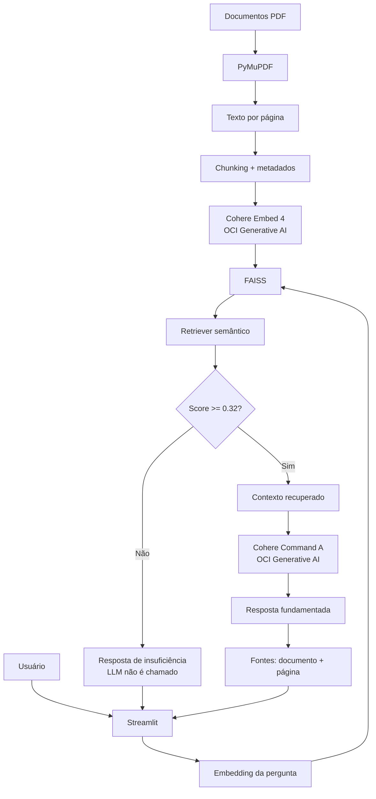

# 🏠 ImobIA — Agente Inteligente de Orientação Imobiliária

O **ImobIA** é um agente inteligente desenvolvido para o **Challenge Alura Agente**. Ele utiliza **RAG (Retrieval-Augmented Generation)** para responder perguntas em linguagem natural com base em uma coleção de documentos PDF sobre compra de imóveis, documentação, financiamento, FGTS e conceitos imobiliários.

O projeto combina **recuperação semântica, grounding documental, controle de alucinação, interface conversacional e integração real com Oracle Cloud Infrastructure (OCI)**.

> **Aplicação publicada na OCI:** http://140.238.185.94:8501

> **Aviso:** a base de conhecimento é fictícia e educacional. O ImobIA não substitui orientação jurídica, financeira, bancária ou imobiliária profissional.

---

## ✨ Principais funcionalidades

- leitura automática de documentos PDF com **PyMuPDF**;
- divisão do conteúdo em chunks com metadados de documento e página;
- embeddings via **OCI Generative AI — Cohere Embed 4**;
- busca vetorial com **FAISS**;
- geração de respostas com **Cohere Command A**;
- limiar mínimo de relevância antes da chamada ao LLM;
- resposta fixa de insuficiência quando a base não sustenta a pergunta;
- exibição das fontes utilizadas na resposta;
- interface conversacional em **Streamlit**;
- histórico durante a sessão e perguntas sugeridas;
- autenticação OCI local por arquivo de configuração;
- autenticação em produção por **Instance Principal**, sem chave privada na VM;
- suíte automatizada de testes e avaliação formal do RAG;
- deploy público em **OCI Compute** com serviço `systemd`.

---

## 🏗️ Arquitetura



### Fluxo resumido

```text
PDFs
  ↓
PyMuPDF
  ↓
chunks + metadados
  ↓
OCI Cohere Embed 4
  ↓
FAISS
  ↓
pergunta → embedding → top-k
  ↓
score >= 0.32 ?
  ├─ não → resposta de insuficiência
  └─ sim → contexto → Cohere Command A → resposta + fontes
```

Mais detalhes em [`docs/arquitetura.md`](docs/arquitetura.md).

---

## 📚 Base de conhecimento

O projeto utiliza cinco PDFs fictícios e educacionais:

| Documento | Conteúdo principal |
|---|---|
| `01_guia_compra_imovel.pdf` | etapas e cuidados gerais na compra de um imóvel |
| `02_documentacao_imovel.pdf` | documentação e verificações relacionadas à operação |
| `03_financiamento_imobiliario.pdf` | simulação, análise de crédito, aprovação, entrada e FGTS |
| `04_faq_imobiliario.pdf` | perguntas frequentes sobre o processo de compra |
| `05_glossario_imobiliario.pdf` | definições de termos imobiliários |

Os arquivos estão em `data/documents/`.

---

## 🧰 Tecnologias

| Tecnologia | Uso |
|---|---|
| Python 3.12 | linguagem principal |
| Streamlit | interface web |
| PyMuPDF | leitura dos PDFs |
| NumPy | manipulação numérica |
| FAISS CPU | índice e busca vetorial |
| OCI Python SDK | integração com a Oracle Cloud |
| OCI Generative AI | embeddings e chat |
| Cohere Embed 4 | embeddings semânticos |
| Cohere Command A | geração das respostas |
| python-dotenv | configuração por variáveis de ambiente |
| Pytest | testes automatizados |
| systemd | execução persistente na VM OCI |

### Modelos e parâmetros principais

```text
Embeddings: cohere.embed-v4.0
Dimensão: 1024

Chat: cohere.command-a-03-2025
Temperatura: 0.10

TOP_K=5
MIN_RELEVANCE_SCORE=0.32
CHUNK_SIZE=900
CHUNK_OVERLAP=120
```

---

## 🗂️ Estrutura do projeto

```text
Challenge-Alura-Agente/
├── app/
│   ├── agent/
│   ├── evaluation/
│   ├── rag/
│   ├── services/
│   ├── ui/
│   ├── config.py
│   └── main.py
├── data/
│   ├── documents/
│   └── vector_store/
├── deploy/
├── docs/
├── evaluation/
├── scripts/
├── tests/
├── .env.example
├── .gitignore
├── Dockerfile
├── requirements.txt
└── README.md
```

---

## 🚀 Execução local

### 1. Clonar o repositório

```bash
git clone https://github.com/ocesarmarques/Challenge-Alura-Agente.git
cd Challenge-Alura-Agente
```

### 2. Criar o ambiente virtual

```bash
python3.12 -m venv .venv
source .venv/bin/activate
```

### 3. Instalar dependências

```bash
python -m pip install -r requirements.txt
```

### 4. Criar o arquivo de ambiente

```bash
cp .env.example .env
```

Configuração principal:

```dotenv
APP_TITLE=ImobIA
TOP_K=5
MIN_RELEVANCE_SCORE=0.32
CHUNK_SIZE=900
CHUNK_OVERLAP=120

OCI_AUTH_MODE=config_file
OCI_PROFILE=DEFAULT
OCI_REGION=sa-saopaulo-1
OCI_COMPARTMENT_ID=

OCI_EMBEDDING_MODEL_ID=cohere.embed-v4.0
EMBEDDING_DIMENSIONS=1024
EMBEDDING_BATCH_SIZE=32

OCI_CHAT_MODEL_ID=cohere.command-a-03-2025
CHAT_TEMPERATURE=0.10
CHAT_MAX_TOKENS=700
```

Para execução local, configure `~/.oci/config` e informe `OCI_COMPARTMENT_ID` no `.env`.

### 5. Validar acesso ao OCI Generative AI

```bash
python -m scripts.check_genai_access
```

### 6. Criar o índice vetorial

```bash
python -m scripts.build_index
```

### 7. Executar o Streamlit

```bash
python -m streamlit run app/main.py
```

Acesse `http://localhost:8501`.

---

## ☁️ Deploy na Oracle Cloud Infrastructure

O deploy final foi realizado em **OCI Compute**, na região `sa-saopaulo-1`.

### Ambiente publicado

| Item | Configuração |
|---|---|
| Cloud | Oracle Cloud Infrastructure |
| Região | `sa-saopaulo-1` |
| Compute | `VM.Standard.E2.1.Micro` |
| Sistema | Oracle Linux 9 |
| Aplicação | Streamlit |
| Porta | `8501/TCP` |
| Autenticação OCI | Instance Principal |
| Processo persistente | `systemd` |
| URL pública | **http://140.238.185.94:8501** |

### Autenticação em produção

Na VM, o ImobIA utiliza:

```dotenv
OCI_AUTH_MODE=instance_principal
```

O acesso ao OCI Generative AI é concedido por **Dynamic Group + IAM Policy**. Nenhuma chave privada OCI é necessária dentro da aplicação publicada.

O ambiente de runtime é gerado com informações da própria instância via IMDSv2:

```bash
sh scripts/generate_oci_runtime_env.sh
cp .env.production .env
```

### Validações realizadas na VM

Foram validados com sucesso:

- Instance Principal;
- embedding real com dimensão **1024**;
- resposta real do **Cohere Command A**;
- criação do índice FAISS;
- carregamento da interface Streamlit;
- resposta RAG com fontes documentais;
- acesso externo pela porta `8501`;
- execução persistente via `systemd`.

O serviço foi configurado para iniciar automaticamente com a instância.

### Evidência de deploy

A aplicação está acessível publicamente em:

**http://140.238.185.94:8501**

Também foram registradas capturas da aplicação funcionando e da instância OCI em estado **Em execução** para a entrega do Challenge.

---

## 💡 Exemplos de perguntas

```text
A simulação do financiamento garante aprovação?
```

```text
Quais documentos o comprador pode precisar apresentar?
```

```text
Posso utilizar FGTS na compra de um imóvel?
```

```text
O que é uma matrícula de imóvel?
```

```text
Qual a diferença entre simulação e aprovação do financiamento?
```

### Exemplo fora da base

Pergunta:

```text
Qual imóvel de São Paulo valorizará mais em 2027?
```

Resposta esperada:

```text
Não encontrei informação suficiente na minha base de conhecimento para responder a essa pergunta.
```

Nesse cenário, o LLM não é chamado e nenhuma fonte é inventada.

---

## 🛡️ Controle de alucinação

O ImobIA utiliza duas barreiras principais.

### 1. Gate de relevância

O melhor contexto recuperado precisa atingir:

```text
MIN_RELEVANCE_SCORE=0.32
```

Se o limiar não for atingido, a execução é interrompida antes da geração.

### 2. Grounding no prompt

Quando existe contexto válido, o modelo é instruído a:

- responder somente com base nos trechos recuperados;
- não preencher lacunas com conhecimento externo;
- não inventar fatos;
- reconhecer quando a base não sustenta uma conclusão.

---

## 🧪 Testes e avaliação

Execute os testes automatizados com:

```bash
python -m pytest -q
```

Além da suíte de testes, o projeto possui uma avaliação formal ponta a ponta com **22 casos**, cobrindo:

- perguntas diretas;
- paráfrases;
- combinação de informações;
- glossário;
- perguntas fora da base;
- anti-alucinação.

### Resultado final da avaliação RAG

| Métrica | Resultado |
|---|---:|
| Casos avaliados | **22** |
| Casos aprovados | **22/22** |
| Taxa geral | **100%** |
| Respostas válidas | **100%** |
| Recusas corretas | **100%** |
| Latência média observada | **1,51 s** |
| Falhas técnicas | **0** |

Execute novamente com:

```bash
python -m scripts.run_evaluation
```

Mais detalhes em [`docs/AVALIACAO.md`](docs/AVALIACAO.md).

---

## 🔒 Segurança

O projeto não versiona credenciais ou artefatos sensíveis.

Proteções principais do `.gitignore`:

```text
.env
*.pem
*.key
.venv/
data/vector_store/*
evaluation/results/*
```

Nunca publique:

- chave privada OCI;
- arquivo `~/.oci/config` real;
- tokens;
- credenciais;
- `.env` preenchido com dados privados.

O repositório também inclui auditoria de segurança:

```bash
python -m scripts.security_audit
```

---

## 📖 Documentação complementar

| Documento | Conteúdo |
|---|---|
| [`docs/arquitetura.md`](docs/arquitetura.md) | arquitetura técnica do RAG |
| [`docs/AVALIACAO.md`](docs/AVALIACAO.md) | metodologia e resultados da avaliação |
| [`docs/DEPLOY_OCI.md`](docs/DEPLOY_OCI.md) | preparação para deploy OCI |
| [`docs/POLITICAS_OCI.md`](docs/POLITICAS_OCI.md) | permissões OCI |
| [`docs/FASE6_GUIA_EXECUCAO.md`](docs/FASE6_GUIA_EXECUCAO.md) | validação do ambiente OCI |
| [`docs/FASE7_UX_INTERFACE.md`](docs/FASE7_UX_INTERFACE.md) | evolução da interface |
| [`docs/FASE8_1_CALIBRACAO.md`](docs/FASE8_1_CALIBRACAO.md) | calibração do retrieval |
| [`docs/FASE9_GITHUB.md`](docs/FASE9_GITHUB.md) | publicação e segurança Git |

---

## 🎯 Checklist do Challenge

| Requisito | Status |
|---|---|
| base de conhecimento em PDF/CSV | ✅ 5 PDFs |
| leitura e processamento dos documentos | ✅ PyMuPDF + chunking |
| perguntas em linguagem natural | ✅ |
| agente com IA generativa | ✅ OCI Generative AI |
| recuperação contextual | ✅ FAISS + embeddings |
| controle de respostas fora da base | ✅ |
| interface funcional | ✅ Streamlit |
| repositório público GitHub | ✅ |
| histórico de commits | ✅ |
| README com arquitetura, tecnologias e execução | ✅ |
| exemplos de perguntas e respostas | ✅ |
| testes do agente | ✅ |
| avaliação formal | ✅ 22/22 |
| deploy OCI | ✅ público |
| evidência de deploy | ✅ URL pública + capturas |

---

## ⚠️ Limitações

A versão atual:

- responde apenas a assuntos cobertos pelos cinco PDFs;
- não consulta taxas bancárias em tempo real;
- não recomenda imóveis específicos;
- não prevê valorização futura;
- não substitui análise documental profissional;
- não substitui orientação jurídica, financeira ou bancária;
- não mantém memória persistente entre sessões.

---

## 👨‍💻 Autor

**César Marques**

Projeto desenvolvido para o **Challenge Alura Agente**, explorando RAG, IA generativa e Oracle Cloud Infrastructure.

---

## ✅ Status final

**Projeto concluído e pronto para entrega.**

```text
✅ Base documental
✅ Pipeline RAG
✅ Embeddings OCI
✅ FAISS
✅ LLM OCI
✅ Interface Streamlit
✅ Controle de alucinação
✅ Avaliação 22/22
✅ GitHub público
✅ Documentação
✅ Deploy público OCI
✅ Evidências finais
```
