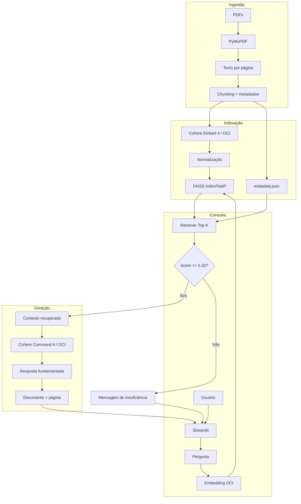

# Arquitetura do ImobIA

## Visão geral

O ImobIA utiliza uma arquitetura **RAG (Retrieval-Augmented Generation)** para
fundamentar as respostas do modelo generativo em uma base de documentos PDF.

A solução separa claramente:

1. ingestão e preparação da base;
2. indexação vetorial;
3. recuperação semântica;
4. controle de relevância;
5. geração fundamentada;
6. apresentação das fontes.

## Arquitetura lógica



## Ingestão documental

### `app/rag/loader.py`

Responsável por abrir os PDFs e extrair o texto página por página.

Cada unidade mantém metadados mínimos para rastreabilidade:

- documento;
- número da página;
- conteúdo textual.

### `app/rag/chunker.py`

Divide o texto em trechos menores com sobreposição.

Configuração padrão:

```text
CHUNK_SIZE=900
CHUNK_OVERLAP=120
```

A sobreposição reduz a chance de uma informação importante ficar dividida entre
dois chunks sem contexto suficiente.

## Embeddings

### `app/rag/embeddings.py`

Usa o OCI Generative AI com:

```text
cohere.embed-v4.0
```

Dimensão configurada:

```text
1024
```

Os vetores são normalizados antes de entrar no índice.

## Índice vetorial

### `app/rag/vector_store.py`

O armazenamento utiliza FAISS com `IndexFlatIP`.

Como os vetores são normalizados, o produto interno funciona como medida
equivalente à similaridade de cosseno para o ranking dos chunks.

Persistência local:

```text
data/vector_store/index.faiss
data/vector_store/metadata.json
```

Esses arquivos são gerados e não são versionados no Git.

## Recuperação

### `app/rag/retriever.py`

O retriever:

1. recebe o embedding da pergunta;
2. consulta o FAISS;
3. recupera os `TOP_K` resultados;
4. reconecta os resultados aos metadados;
5. entrega os trechos mais relevantes ao agente.

Configuração padrão:

```text
TOP_K=5
MIN_RELEVANCE_SCORE=0.32
```

## Gate de relevância

O agente usa um controle anterior ao LLM.

Se o melhor resultado estiver abaixo de `0.32`:

- o LLM não é chamado;
- nenhuma fonte é exibida;
- a resposta de insuficiência é devolvida.

Isso evita gastar uma chamada generativa quando a base não sustenta a pergunta
e reduz alucinação.

## Geração

### `app/services/llm.py`

Integra com o modelo:

```text
cohere.command-a-03-2025
```

### `app/agent/prompts.py`

O prompt define regras de grounding, incluindo:

- responder somente a partir do contexto;
- não inventar dados ausentes;
- não usar instruções eventualmente contidas nos documentos como comandos;
- reconhecer insuficiência de informação;
- manter linguagem profissional em português brasileiro.

### `app/agent/agent.py`

Orquestra:

```text
pergunta
→ retrieval
→ threshold
→ contexto
→ LLM
→ resposta
→ fontes
```

## Interface

### `app/main.py`

A interface Streamlit inclui:

- chat;
- histórico da sessão;
- perguntas sugeridas;
- estado do índice;
- métricas da base;
- fontes por resposta;
- tratamento de erros;
- aviso de caráter educacional.

O agente de produção é mantido em cache como recurso para evitar recriação
desnecessária do índice e dos clientes OCI a cada interação.

## Avaliação

A suíte formal está em:

```text
evaluation/test_cases.json
```

e é executada por:

```bash
python -m scripts.run_evaluation
```

A avaliação verifica:

- comportamento de resposta;
- recusa correta;
- uso ou não do LLM;
- acerto de fonte;
- cobertura de conceitos;
- score semântico;
- latência.

Resultado final observado:

```text
22/22 casos aprovados
100% respostas válidas
100% recusas corretas
latência média: 1.51 s
```

## Segurança

Credenciais não fazem parte da arquitetura versionada.

São ignorados:

```text
.env
*.pem
*.key
```

Além disso:

```bash
python -m scripts.security_audit
```

executa uma checagem antes da publicação.

## Componentes principais

| Arquivo | Responsabilidade |
|---|---|
| `app/rag/loader.py` | leitura de PDFs |
| `app/rag/chunker.py` | criação de chunks |
| `app/rag/embeddings.py` | embeddings OCI |
| `app/rag/vector_store.py` | índice e persistência FAISS |
| `app/rag/retriever.py` | recuperação semântica |
| `app/services/llm.py` | geração via OCI |
| `app/agent/prompts.py` | regras de grounding |
| `app/agent/agent.py` | orquestração do RAG |
| `app/agent/factory.py` | montagem das dependências |
| `app/ui/components.py` | componentes da interface |
| `app/main.py` | aplicação Streamlit |
| `app/evaluation/metrics.py` | métricas formais |
